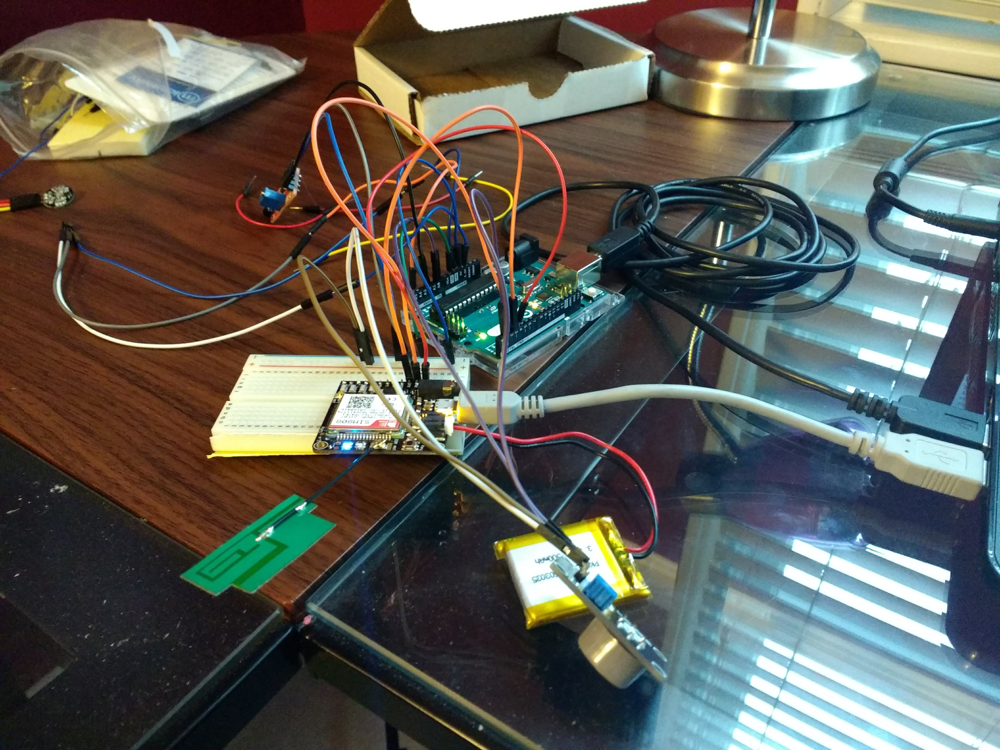
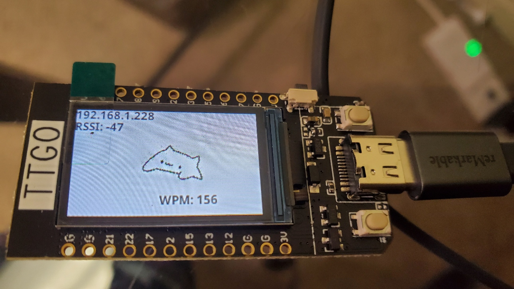

## Status Screen on an MCU
*View the source on [GitHub](https://github.com/Saad-Mufti/arduino-status-screen)*

Lately I've felt that I haven't done anything "fun" on an embedded device, since much of my projects on MCUs have mainly been focused on meeting some kind of goal to solve a problem that I find important. 

For example, a while back I made a prototype for a wearable device with sensors to attempt to detect when the wearer might be in danger, and the onboard GPS module would send a text via SMS to any trusted contacts, along with the local authorities. It ended up looking something like this:
<!--  -->


That was one of my first endeavors with embedded devices, and although the design presented significant challenges with my limited resources available, it was what really got me into building small but powerful things with tiny computers.

Building this wearable prototype was also a tangible way of attacking a problem that otherwise seems difficult for me to take on otherwise: automating 911 calls. 

This time, however, I decided instead to skip the "big problem" portion of the design. 

**Put simply, I wanted a device that, when plugged into my PC, would display some information in a dashboard-like manner.**

Specifically, I was looking to display metrics like: 
- My typing speed (in WPM)
- Ambient temperature (or my internal PC temp.)
- CPU/RAM usage

I also considered displaying information of the MCU itself, like:
- Current SSID (Network name)
- WiFi Signal strength (in dB)
- Input voltage

Finally, if I would have sufficient screen space at the end, I also wanted to pull some data from a REST API to show other potentially useful metrics:
- Local weather info
- Stock tickers
- Unread emails (I'd have to look more into if this would be possible or not)

These metrics vary in difficulty to implement, so as of the time of writing, I only have a subset of these indicators figured out. *Stay tuned for further updates*.

Here's what my dashboard looks like so far:
<!--  -->


Regardless, there are clearly three sources where I can pull data from:
1. My PC (connected to the MCU via USB)
2. The device itself (through its internal API)
3. The web (through a protocol like HTTP)

I have features from the first two categories so far, but I'll describe how one can pull this data from any of these sources.

#### Pulling data from my PC
The MCU would be connected to my PC via USB, which is a form of (serial communication)[https://en.wikipedia.org/wiki/Serial_communication]. Most MCUs have a relatively straightforward way of reading and sending serial data, so this didn't end up being a significant challenge, except for the fact that I would have to provide the data I wanted by myself. There isn't anything built into Windows et. al., as far as I know, that allows me to collect the data I want. 

My solution was to write a simple Python script to periodically send serial data. Specifically, I wrote a script for collecting keyboard data, and calculating my WPM periodically:
```
from pynput.keyboard import Key, Listener
import serial
from serial.tools import list_ports
import time, threading, sys
import ctypes

# Average word length (in characters)
AWL = 5
wpm = 0
ch_cnt = 0
words = 0
t0 = time.time()

ports = list_ports.comports()
matches = list(filter(lambda i: i.vid == 0x1A86 and i.pid == 0x55D4, ports))
matches = list(map(lambda a: a.name, matches))
name = ""
if len(matches) > 0:
    name = matches[0]
else:
    ctypes.windll.user32.MessageBoxW(None, "Device not found. Please plug it in and try again.", "Error", 0)
    sys.exit()
connection = serial.Serial(name, 250_000)


prev_key = None
def on_press(key):
    global prev_key, words
    if key == Key.space and key != prev_key or prev_key == None:
        words += 1
    prev_key = key
    

def on_release(key):
    return


words_tmp = 0
fails = 0
def calc():
    global wpm, words_tmp, words
    t = 5
    wpm = 60 * (words - words_tmp) // t
    print("WPM: " + str(wpm))
    if not connection.isOpen():
        try:
            connection.open()
        except: 
            print("Cannot open connection with port")
    
    try:
        connection.write(str(wpm).encode())
    except:
        global fails
        print("Device not available")
        if connection.isOpen():
            connection.close()
        fails += 1
        if fails == 100:
            sys.exit()
    words_tmp = words
    threading.Timer(t, calc).start()

calc()

with Listener(on_press=on_press, on_release=on_release) as listener:
    listener.join()
```

For my purposes, I found `pynput` most useable for collecting keyboard data, and the built-in `ctypes` package suitable for displaying error messages. 

The source is available to see, but I'll summarize what's going on:
- The first thing that needs to happen is the script needs to find the MCU on a serial port. On Windows, these devices are typically listed as `COM<X>`, where `<X>` is some integer. The issue is, depending on which port I would plug a serial device into, this number would not stay constant. So, I instead rely on the MCU's vendor id (VID) and PID, which in this case are unique to this type of device. You can most easily find this information if you open Device Manager on Windows.
- I calculate WPM in a rather crude way, and you can most likely find more robust methods elsewhere, since my method does not check the integrity of what the user is typing. The algorithm only checks for spaces to separate words, so pressing `e` and `Space` in rapid succession results in a very high WPM.
- I add some basic error handling, including if the program can't find a serial device, and fails gracefully after 100 tries or so.

For the purposes of sharing with others, I plan to turn this script into a Windows executable (`.exe`) so anyone can simply download this and let it run in the background. 

#### Pulling data from the MCU
This is the most straightforward of the three sources. Using the [library provided by TTGO](https://github.com/Xinyuan-LilyGO/TTGO-T-Display), there are various metrics we can easily collect, including battery voltage, network strength (assuming the MCU is connected), among others.

#### Pulling from the web
I haven't gotten around to pulling data from the web, but I've found some sources that I may plan to collect from:
- For weather data, [OpenWeather](https://openweathermap.org/api) seems like a useful choice.
- [Polygon.io](https://polygon.io/) for stock data.

Luckily, the ESP32 chip, which is the component responsible for internet connectivity, has significant community support, and their functionality to easily make network calls can be found [here](https://docs.espressif.com/projects/esp-idf/en/latest/esp32/api-reference/network/index.html).